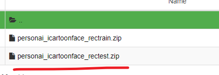

# 动漫人脸识别项目(开发中)

## 数据集准备

数据集地址：https://github.com/luxiangju-PersonAI/iCartoonFace

数据集包括两个部分检测部分和识别部分


### 人脸检测的数据集准备
我们先看一下检测的数据集


测试的数据在那个识别的数据集里面



测试集标签是下面这个


我们对这些数据进行整理，整理出的格式如下，比如我们训练的图片放在`train/images`里去，其他的一样。
```
├── test
│   ├── images
│   └── labels
├── train
│   ├── images
│   └── labels
├── val
│   ├── images
│   └── labels
├── test.txt
├── train.txt
└── val.txt
```
然后`train.txt`等几个txt就是所有图片的坐标信息了，我们先全部转换下面这样的格式，图片和坐标之间使用逗号隔开


当然，这种的格式不能被YOLOV5识别，我们可以参考 https://github.com/ultralytics/yolov5/wiki/Train-Custom-Data 来设置自己的数据集

这里我写了一个脚本可以把我们这种格式的数据转换为yolov5的格式。转换前自己要确保我们这个检测的数据集在 `data/detection` 下。具体可以自己看看脚本内容
```bash
cd tool
python set_yolo_label.py
```

转换后，我们就可以看到labels目录下有很多文本文件，一个图片对应一个文本文件，具体如下


里面的文本文件格式如下


### 人脸识别数据集准备

人脸识别我采用的 https://github.com/siriusdemon/Build-Your-Own-Face-Model/tree/master/recognition 项目。
我们需要先准备一下数据集，这里暂时不需要测试数据，我们直接训练即可。

目录如下，train里面放所有待训练的图片，train.txt就是我们待训练的数据了
```
.
├── images
├── train
└── train.txt
```

`train.txt` 的格式如下


因为原始图片是没有裁剪过的，我们需要根据`train.txt`的文件进行裁剪，使用下面的命令快速对图片进行裁剪

> 这个函数会对图片进行缩放,全部设置为`250*250`大小的图片，如果不想缩放，那么就自己去注释代码里面的对应内容即可

```bash
cd tool
python process_recognize.py
```

处理完后格式如下，每个人物都有对应的编号，每个编号对应一个文件夹，对应的文件夹就是这个编号所有的图片了
```
.
├── images
│   ├── 00000
│   ├── 00001

```

## 模型训练

### yolov5 模型训练

```bash
# 首先我们克隆一下yolov5项目
git clone https://github.com/ultralytics/yolov5.git
cd yolov5
# 需要注意，我们需要修改models下yolov5m.yaml的nc=1，表示我们只有一个类别。如果你选择的其他模型，也是一样的
# 开始训练我们的数据集，如果爆显存可以把batch改小一点，如果不想迭代这么久可以把epochs改小一点
python train.py --batch 16 --epochs 50 --data ../dataset.yaml --weights yolov5m.pt
```

训练完后我们 `runs/train/exp*/weights`里面，我们直接使用 `best.pt` 模型就可以了

### 人脸识别模型训练

所有的配置都在 `core/recognize/config.py` 里面，大家修改一下即可

```bash
python arce_face_train.py
```

## 模型测试
### yoloV5 模型测试

```bash
python yolov5/detect.py --weights model/best.pt --source sample/002.jpeg
```