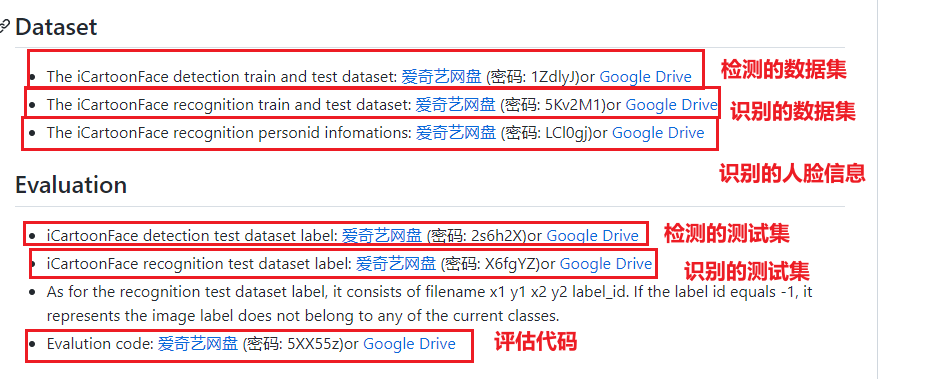

# 动漫人脸识别项目(开发中)

## 数据集准备

数据集地址：https://github.com/luxiangju-PersonAI/iCartoonFace

数据集包括两个部分检测部分和识别部分


#### 检测的数据集准备
我们先看一下检测的数据集


测试的数据在那个识别的数据集里面


测试集标签是下面这个


我们对这些数据进行整理，整理出的格式如下，比如我们训练的图片放在`train/images`里去，其他的一样。
```
├── test
│   ├── images
│   └── labels
├── train
│   ├── images
│   └── labels
├── val
│   ├── images
│   └── labels
├── test.txt
├── train.txt
└── val.txt
```
然后`train.txt`等几个txt就是所有图片的坐标信息了，我们先全部转换下面这样的格式，图片和坐标之间使用逗号隔开


当然，这种的格式不能被YOLOV5识别，我们可以参考 https://github.com/ultralytics/yolov5/wiki/Train-Custom-Data 来设置自己的数据集

这里我写了一个脚本可以把我们这种格式的数据转换为yolov5的格式。转换前自己要确保我们这个检测的数据集在 `data/detection` 下。具体可以自己看看脚本内容
```bash
cd tool
python set_label.py
```

转换后，我们就可以看到labels目录下有很多文本文件，一个图片对应一个文本文件，具体如下


里面的文本文件格式如下


## 模型训练

### yolov5 模型训练
```bash
# 首先我们克隆一下yolov5项目
git clone https://github.com/ultralytics/yolov5.git
cd yolov5
# 需要注意，我们需要修改models下yolov5m.yaml的nc=1，表示我们只有一个类别。如果你选择的其他模型，也是一样的
# 开始训练我们的数据集
python train.py --img 640 --batch 16 --epochs 50 --data ../dataset/dataset.yaml --weights yolov5m.pt
```
